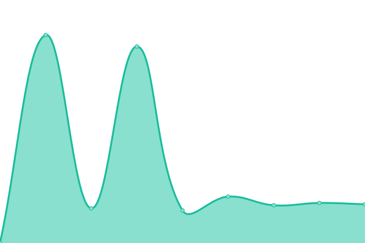
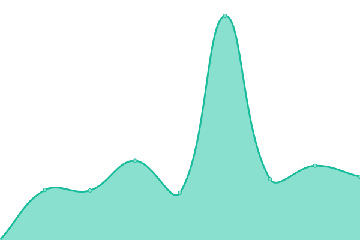

# [📈 Live Status](https://ichengchao.github.io/myuptime): <!--live status--> **🟩 All systems operational**

This repository contains the open-source uptime monitor and status page for [cheng chao](https://blog.chengchao.name), powered by [Upptime](https://github.com/upptime/upptime).

With [Upptime](https://upptime.js.org), you can get your own unlimited and free uptime monitor and status page, powered entirely by a GitHub repository. We use [Issues](https://github.com/ichengchao/myuptime/issues) as incident reports, [Actions](https://github.com/ichengchao/myuptime/actions) as uptime monitors, and [Pages](https://ichengchao.github.io/myuptime) for the status page.

<!--start: status pages-->
<!-- This summary is generated by Upptime (https://github.com/upptime/upptime) -->
<!-- Do not edit this manually, your changes will be overwritten -->
<!-- prettier-ignore -->
| URL | Status | History | Response Time | Uptime |
| --- | ------ | ------- | ------------- | ------ |
|  [Google](https://www.google.com) | 🟩 Up | [google.yml](https://github.com/ichengchao/myuptime/commits/HEAD/history/google.yml) | 

 205ms
     
 | 

<a href="https://ichengchao.github.io/myuptime/history/google">100.00%</a>
    

|  [chengchao.name](https://www.chengchao.name) | 🟩 Up | [chengchao-name.yml](https://github.com/ichengchao/myuptime/commits/HEAD/history/chengchao-name.yml) | 

 1060ms
     
 | 

<a href="https://ichengchao.github.io/myuptime/history/chengchao-name">99.79%</a>
    

|  [chengchao blog](https://blog.chengchao.name) | 🟩 Up | [chengchao-blog.yml](https://github.com/ichengchao/myuptime/commits/HEAD/history/chengchao-blog.yml) | 

 1586ms
     
 | 

<a href="https://ichengchao.github.io/myuptime/history/chengchao-blog">100.00%</a>
    

|  [chengchao site](https://chengchao.name/springrun/) | 🟩 Up | [chengchao-site.yml](https://github.com/ichengchao/myuptime/commits/HEAD/history/chengchao-site.yml) | 

 1231ms
     
 | 

<a href="https://ichengchao.github.io/myuptime/history/chengchao-site">100.00%</a>
    

<!--end: status pages-->

[**Visit our status website →**](https://ichengchao.github.io/myuptime)

## 📄 License

- Powered by: [Upptime](https://github.com/upptime/upptime)
- Code: [MIT](./LICENSE) © [cheng chao](https://blog.chengchao.name)
- Data in the `./history` directory: [Open Database License](https://opendatacommons.org/licenses/odbl/1-0/)
